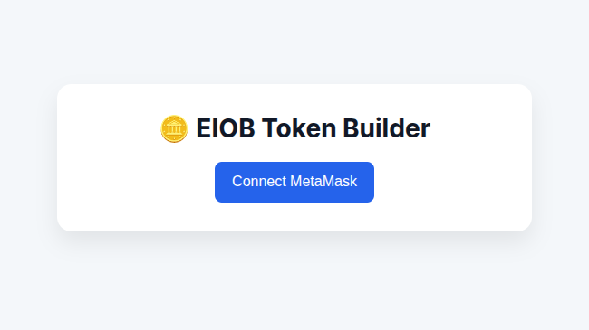
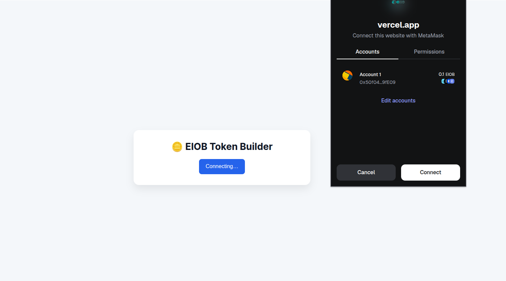
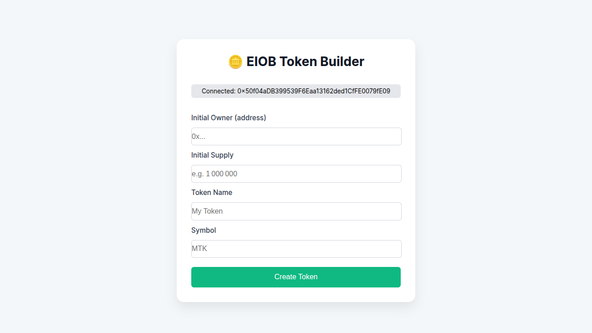
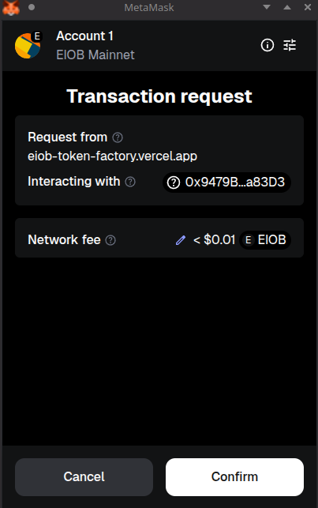
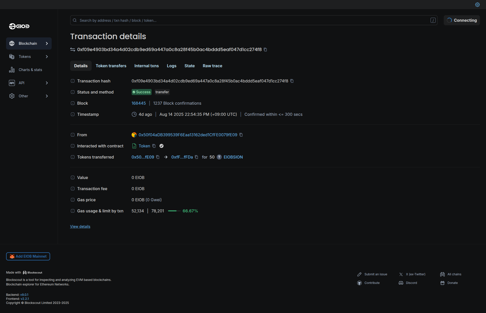
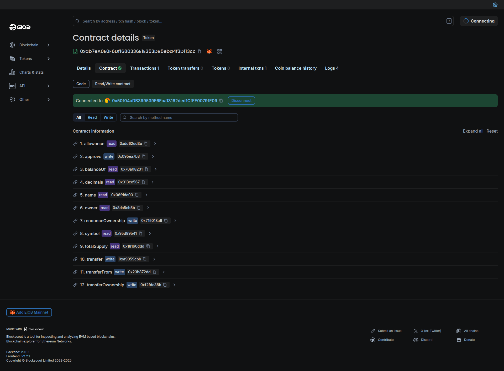

# EIOB 토큰 빌더 사용 방법

## 토큰 빌더 이용 전 필수 준비
1. [Metamask](https://metamask.io/) 지갑이 설치된 브라우저
2. Metamask 지갑은 EIOB Mainnet에 연결되어있어야 합니다.

## ERC20 토큰 발급법
### 1. **메타마스크 연결** 버튼 클릭

### 2. 메타마스크 지갑 연결하기

### 3. 토큰 세부 정보 추가

새로 생성할 토큰의 세부 정보를 입력하세요.

### 4. EIOB 메인넷에 토큰 생성하기

**토큰 생성** 버튼을 누른 후 Metamask에서 거래를 확인하여 EIOB Mainnet에 새로운 토큰을 생성하세요.

### 5. 블록 탐색기에서 거래 확인하기

거래가 완료될 때까지 기다렸다가 Explorer에서 새 토큰의 세부 정보를 확인하세요.

### 6. 새 토큰과 상호 작용하기

거래 페이지에서 **Token**로 이동하여 토큰의 스마트 컨트랙트를 확인하고 새 토큰과 상호작용하세요.